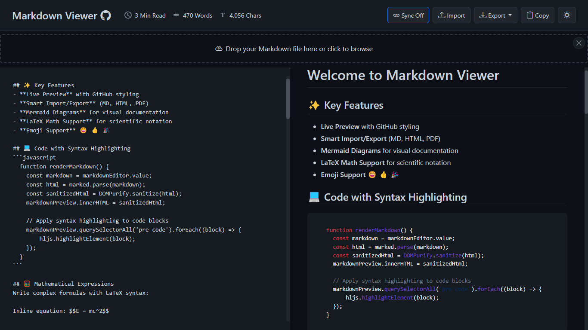
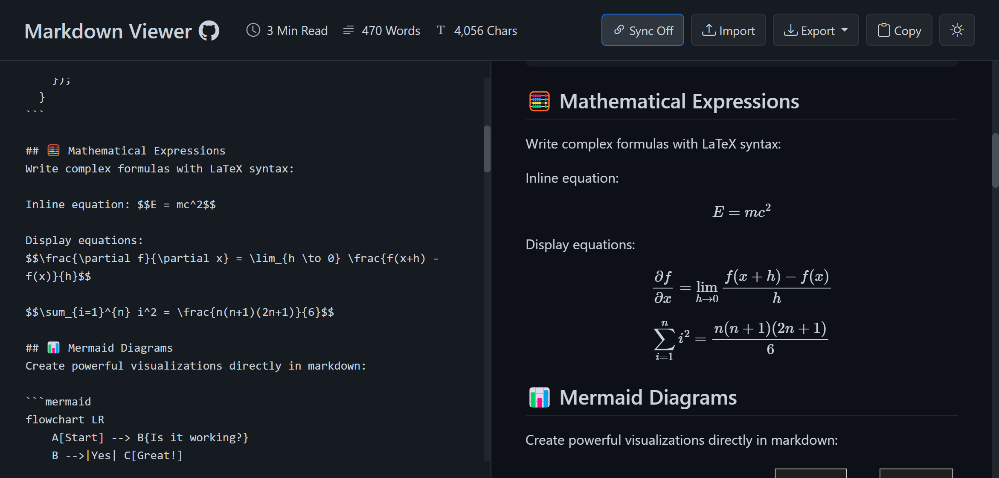
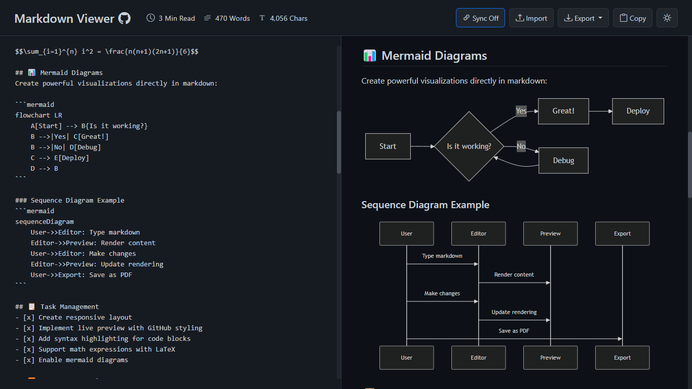
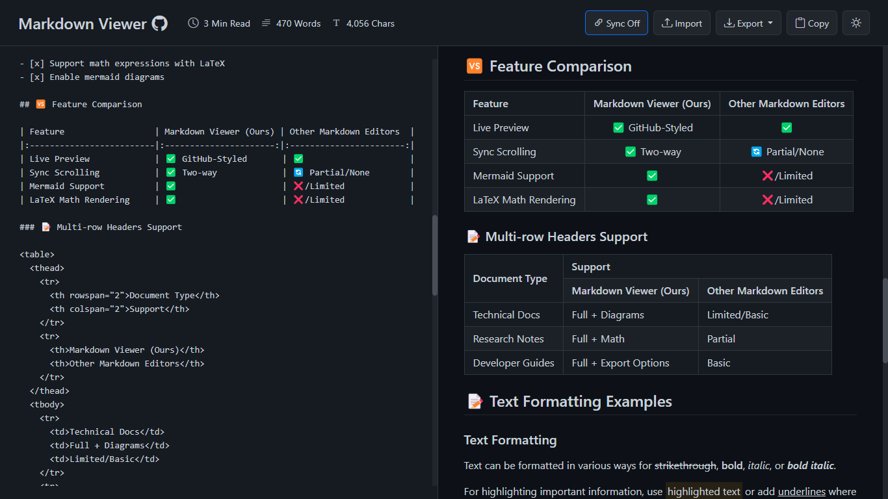

# Markdown Viewer

<div align="center">
    
    <h3>A powerful GitHub-style Markdown rendering tool</h3>
    <p>Fast, secure, and feature-rich - all running in your browser</p>
    <a href="https://markdownviewer.pages.dev/">Live Demo</a> • 
    <a href="#-features">Features</a> • 
    <a href="#-screenshots">Screenshots</a> • 
    <a href="#-usage">Usage</a> • 
    <a href="#-license">License</a>
</div>

## 🚀 Overview

Markdown Viewer is a professional, full-featured Markdown editor and preview application that runs entirely in your browser. It provides a GitHub-style rendering experience with a clean split-screen interface, allowing you to write Markdown on one side and instantly preview the formatted output on the other.

## ✨ Features

- **GitHub-style Markdown rendering** - See your Markdown exactly as it would appear on GitHub
- **Live preview** - Instantly see changes as you type
- **Syntax highlighting** - Beautiful code highlighting for multiple programming languages
- **LaTeX math support** - Render mathematical equations using LaTeX syntax
- **Mermaid diagrams** - Create diagrams and flowcharts within your Markdown
- **Dark mode toggle** - Switch between light and dark themes for comfortable viewing
- **PDF export** - Download your content as PDF with a filename based on the document title and clickable, hierarchical bookmarks
- **Import Markdown files** - Drag & drop or select files to open
- **Copy to clipboard** - Quickly copy your Markdown content with one click
- **Sync scrolling** - Keep editor and preview panes aligned (toggleable)
- **Content statistics** - Track word count, character count, and reading time
- **Fully responsive** - Works on desktop and mobile devices
- **Emoji support** - Convert emoji shortcodes into actual emojis
- **100% client-side** - No server processing, ensuring complete privacy and security
- **No sign-up required** - Use instantly without any registration

## 📸 Screenshots

### Code Syntax Highlighting


### Mathematical Expressions Support


### Mermaid Diagrams


### Tables Support


## 📝 Usage

1. **Writing Markdown** - Type or paste Markdown content in the left editor panel
2. **Viewing Output** - See the rendered HTML in the right preview panel
3. **Importing Files** - Click "Import" or drag and drop .md files into the interface
4. **Exporting Content** - Click "Export" (or press Ctrl/Cmd+S) to download a PDF. The filename uses the first H1, then the YAML `title`, then the first H2, and finally `Document.pdf` if none is available. Unsupported filename characters are replaced with spaces.
   Headings H2–H6 become hierarchical bookmarks in the PDF reader's sidebar. Each bookmark jumps to the page containing its heading, using the final export pagination. H1 headings, blank headings, code examples, and hidden footnote labels are excluded. Documents without H2–H6 headings export normally without bookmarks. Readers that support the PDF opening preference show the bookmarks panel automatically.
5. **Toggle Dark Mode** - Click the moon icon to switch between light and dark themes
6. **Toggle Sync Scrolling** - Enable/disable synchronized scrolling between panels

### Supported Markdown Features

- Headings (# H1, ## H2, etc.)
- **Bold** and *italic* text
- ~~Strikethrough~~
- [Links](https://example.com)
- Images
- Lists (ordered and unordered)
- Tables
- Code blocks with syntax highlighting
- Blockquotes
- Horizontal rules
- Task lists
- LaTeX equations (inline and block)
- Mermaid diagrams
- YAML Front Matter (`---` at the start of a document): render `title` as an H1 when the body has no H1, and hide other metadata
- Footnotes with repeated references and backlinks (`[^note]`)
- GitHub alerts (`> [!NOTE]`, `TIP`, `IMPORTANT`, `WARNING`, `CAUTION`)
- Documentation admonitions (`:::note`, `:::tip`, `:::info`, `:::warning`, `:::danger`, `:::important`, `:::caution`), including nested blocks and custom titles
- Stable heading anchors, including Chinese headings and repeated heading names
- Code fences with language metadata (for example, `bash title="example.sh" {1}` keeps Bash highlighting; filenames and line emphasis are not displayed)
- Safe HTML such as `<details>`, `<summary>`, `<mark>`, `<sub>` and `<sup>`

### Front Matter and documentation syntax

```markdown
---
slug: /redis-practical-guide
title: Redis 常用命令与实战手册
tags: [Redis, 缓存]
---

## 常用命令

> [!NOTE]
> This is a GitHub-style note.

:::tip[Usage tip]
Admonition bodies support **Markdown** and footnotes[^redis].
:::

[^redis]: Footnote text.
```

The preview displays `title` as plain text in an H1 only when the body has no H1 of its own. A body H1 takes precedence regardless of its text or position; headings inside code examples do not count. Other metadata is hidden; missing, empty or non-string titles do not create a heading. YAML arrays, nested fields, multiline strings, UTF-8 BOM and Windows line endings are accepted. The closing delimiter can be `---` or `...`.

Front Matter is recognized only at the very start of the document. YAML inside a code fence stays visible as code. Invalid or unclosed Front Matter is left in the Markdown instead of silently discarding content. These rules also apply to PDF export; copying preserves the original source.

These are specific Markdown extensions, not a full MDX or documentation-site runtime: React components, imports, site routing (`slug`), and arbitrary plugins are not executed. See [the complete syntax fixture](tests/fixtures/markdown-extensions.md) for a document you can import into the viewer.

### Development tests

The app still runs as static HTML/CSS/JavaScript without a build step. Node.js dependencies are used only for regression tests and mirror the browser's pinned parser versions.

```sh
npm ci
npm test
```

See [tests/README.md](tests/README.md) for preview and export checks.

## 🔧 Technologies Used

- HTML5
- CSS3
- JavaScript
- [Bootstrap](https://getbootstrap.com/) - Responsive UI framework
- [Marked.js](https://marked.js.org/) - Markdown parser
- [highlight.js](https://highlightjs.org/) - Syntax highlighting
- [MathJax](https://www.mathjax.org/) - Mathematical expressions
- [Mermaid](https://mermaid-js.github.io/mermaid/) - Diagrams and flowcharts
- [DOMPurify](https://github.com/cure53/DOMPurify) - HTML sanitization
- [html2canvas.js](https://github.com/niklasvh/html2canvas) + [jsPDF](https://www.npmjs.com/package/jspdf)- PDF generation
- [JoyPixels](https://www.joypixels.com/) - Emoji support

## 🤝 Contributing

Contributions are welcome! Please feel free to submit a Pull Request.

1. Fork the project
2. Create your feature branch (`git checkout -b amazing-feature`)
3. Commit your changes (`git commit -m 'Add some amazing feature'`)
4. Push to the branch (`git push origin amazing-feature`)
5. Open a Pull Request

## 📄 License

This project is licensed under the MIT License - see the [LICENSE](LICENSE) file for details.

## 📈 Development Journey

The Markdown Viewer has undergone significant evolution since its inception. What started as a simple markdown parser has grown into a full-featured, professional application with multiple advanced capabilities. By comparing the [current version](https://markdownviewer.pages.dev/) with the [original version](https://a1b91221.markdownviewer.pages.dev/), you can see the remarkable progress in UI design, performance optimization, and feature implementation.

---

<div align="center">
    <p>Developed with ❤️ by <a href="https://github.com/ThisIs-Developer">ThisIs-Developer</a></p>
</div>
